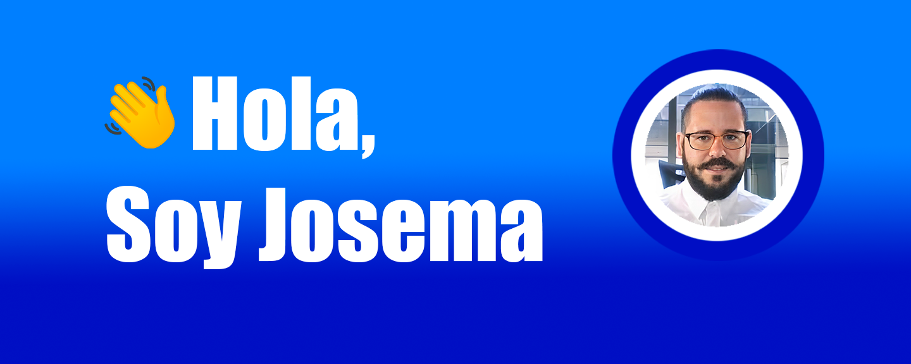

### Sobre mi
Mi nombre es Jose Manuel o como todo el mundo me llama Josema.

Soy estudiante de DAM, proximo a graduarme. Tengo experiencia en el sector de las infraestructuras IT, como diseñador de redes FTTH y HFC durante más de 15 años. 

Actualmente en busca de mi primer trabajo como desarrollador de aplicaciones.

Lenguajes:

<!--
**JosemaMoreno/josemamoreno** is a ✨ _special_ ✨ repository because its `README.md` (this file) appears on your GitHub profile.

Here are some ideas to get you started:

- 🔭 I’m currently working on ...
- 🌱 I’m currently learning ...
- 👯 I’m looking to collaborate on ...
- 🤔 I’m looking for help with ...
- 💬 Ask me about ...
- 📫 How to reach me: ...
- 😄 Pronouns: ...
- ⚡ Fun fact: ...
-->
